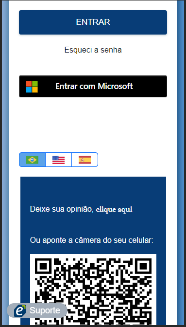

# Effettivo - Login

Este projeto foi desenvolvido profissionalmente, com o objetivo de melhorar a usabilidade dos usuários, o layout, a responsividade e a segurança. A aplicação foi construída utilizando C# com o framework Asp.Net Web Forms, JavaScript, HTML, CSS, Bootstrap e SQL Server. 

## Funcionalidades

- Acesso dos usuários, utilizando criptografia nas senhas.
- Disponibilidade de realizar o acesso utilizando conta de e-mail da Microsoft.
- Disponibilidade de três idiomas: Português, Inglês e Espanhol.
- Bloqueio de acesso pelo IP ao realizar muitas tentativas.
- Verificação de CAPTCHA.
- Opção de troca de senha, com verificações de segurança.
- Chat online com acesso direto a equipe de suporte.

## Destaques

- Layout moderno, com informações claras e opções de acessibilidade, com três idiomas disponíveis.
- Acesso rápido a página de ouvidoria do sistema, utilizando QR Code.
- Responsividade, com elementos que se adequam a todos os tamanhos de tela de dispositivos.

## Imagens

